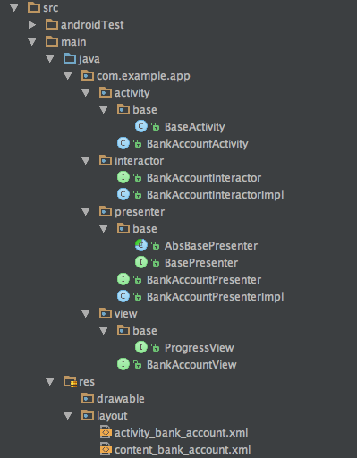

# Android MVP templates
Android Studio templates for MVP pattern

## Template
### MVP Activity Skeleton - MVP skeleton based on Activity
This template generates MVP Skeleton (`Presenters`, `Views`, `Activities` with `layouts`, `Interactors`, `Base classes`)

## How to use?
### Template Usage
- [Select package where MVP skeleton should be created](img/template_creation.png)
- [Configure MVP template](img/template_configuration.png)

### Template import - Easy way
- Clone repository
- Execute `copy.sh`
- Restart Android Studio

### Template import - Alternate way
- Clone repository
- Place it in `Mac -> Applications -> Android Studio -> Right Click Show Package Contents -> Contents -> plugins -> android -> lib -> templates -> other`
- Restart Android Studio

